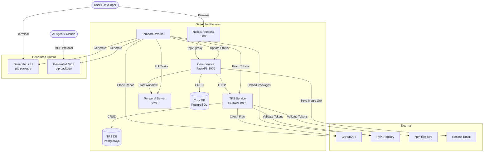
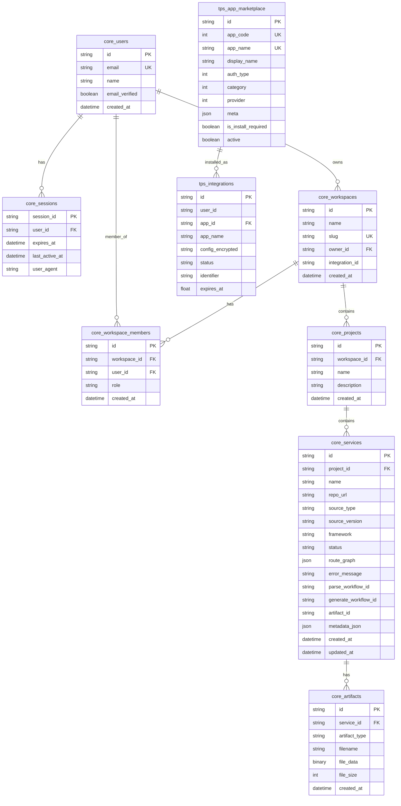
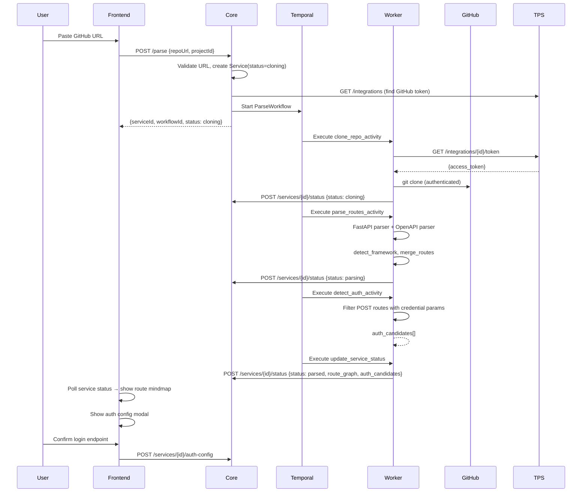
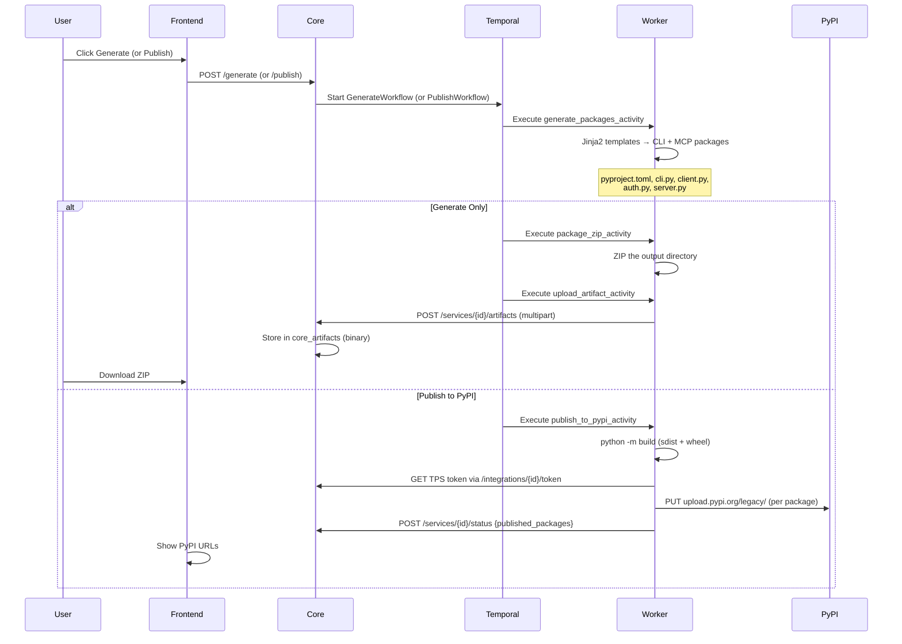
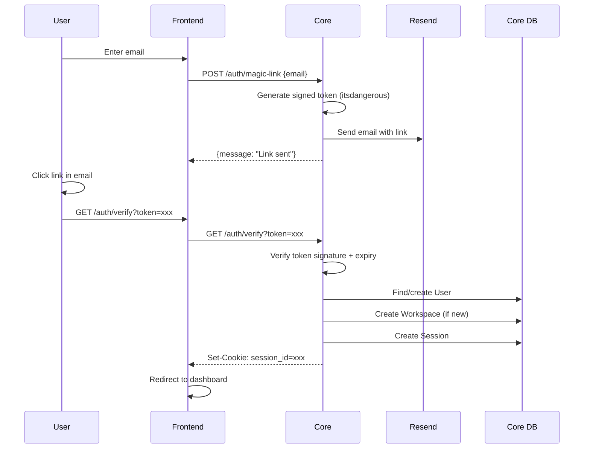
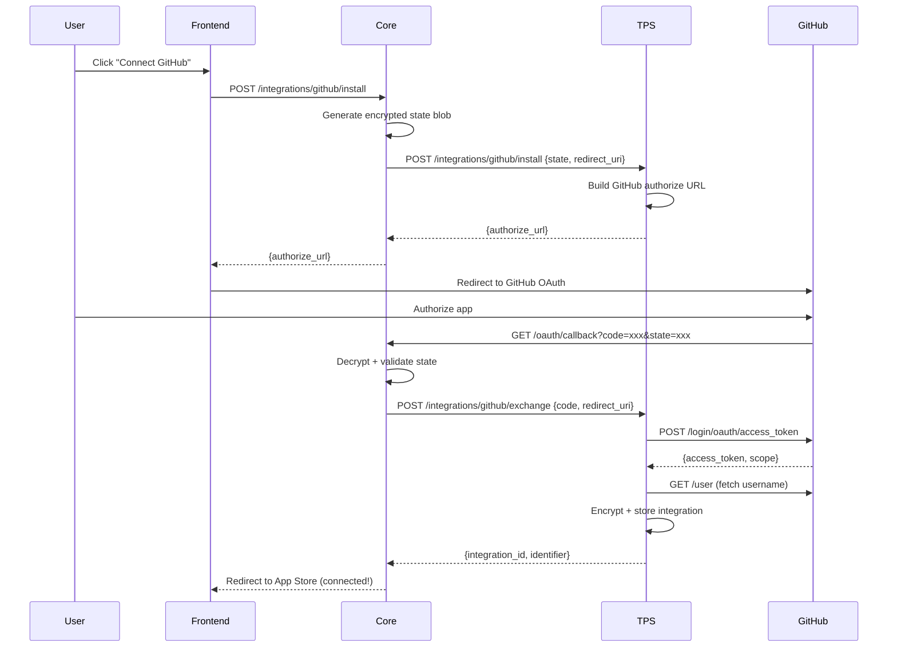

# GenAlpha CLI — System Architecture

## System Context Diagram

## Service Architecture (Component Diagram)

```mermaid
graph LR
    subgraph "Core Service :8000"
        direction TB
        AuthRoutes[Auth Routes<br/>/auth/*]
        ProjectRoutes[Project Routes<br/>/projects/*]
        ServiceRoutes[Service Routes<br/>/services/*]
        ParseRoute[Parse Route<br/>/parse, /parse/pypi]
        GenerateRoute[Generate Route<br/>/generate]
        PublishRoute[Publish Route<br/>/publish]
        ArtifactRoutes[Artifact Routes<br/>/artifacts/*]
        IntegrationProxy[Integration Routes<br/>/integrations/*]
        OAuthCallback[OAuth Callback<br/>/oauth/callback]

        CoreModels[Models<br/>User, Session, Workspace<br/>Project, Service, Artifact]
        TpsClient[TPS Client SDK]
        TemporalClient[Temporal Client]
    end

    subgraph "TPS Service :8001"
        direction TB
        AppRoutes[App Routes<br/>/apps/*]
        IntegRoutes[Integration Routes<br/>/integrations/*]

        Handlers[Handler Registry<br/>GitHub, PyPI, npm]
        IntegService[Integration Service<br/>create, refresh, delete]
        Crypto[Crypto<br/>MultiFernet encrypt/decrypt]

        TPSModels[Models<br/>AppMarketplace<br/>Integration]
    end

    subgraph "Worker"
        direction TB
        ParseWF[ParseWorkflow]
        PyPIParseWF[PyPIParseWorkflow]
        GenerateWF[GenerateWorkflow]
        PublishWF[PublishWorkflow]

        CloneAct[clone_repo_activity]
        ParseAct[parse_routes_activity]
        AuthDetect[detect_auth_activity]
        FetchPyPI[fetch_pypi_sdist_activity]
        GenAct[generate_packages_activity]
        ZipAct[package_zip_activity]
        UploadAct[upload_artifact_activity]
        PublishAct[publish_to_pypi_activity]
        StatusAct[update_service_status]
        CleanupAct[cleanup_clone_activity]
    end

    subgraph "CLI Library (src/genalphacli)"
        direction TB
        Pipeline[Pipeline<br/>run_pipeline]
        FastAPIParsers[FastAPI Parser<br/>AST extraction]
        OpenAPIParsers[OpenAPI Parser<br/>spec parsing]
        ConfigDetector[Config Detector<br/>auth + base_url]
        PipGen[Pip Generator<br/>CLI templates]
        MCPGen[MCP Generator<br/>MCP templates]
        Models[Models<br/>CommandGraph, AuthConfig<br/>Subcommand, RouteParam]
        PyPIClient[PyPI Client<br/>fetch, download, extract]
        GitHubClient[GitHub Client<br/>clone, detect framework]
    end
```

## Database Schema (ERD)

## Workflow Diagrams

### Parse Flow (GitHub)

### Generate + Publish Flow

### Auth Flow (Magic Link)

### OAuth Integration Flow (GitHub)

## Tech Stack

| Layer | Technology |
|-------|-----------|
| Frontend | Next.js 16, React 19, TypeScript, Tailwind CSS, React Query |
| Core API | Python, FastAPI, SQLModel, asyncpg |
| TPS API | Python, FastAPI, SQLModel, asyncpg, MultiFernet |
| Worker | Python, Temporal SDK, httpx |
| CLI Library | Python, Jinja2 (sandboxed), AST parsing |
| Database | PostgreSQL 18 (dual: core + tps) |
| Orchestration | Temporal (workflows + activities) |
| Infrastructure | Docker Compose (Postgres + Temporal + Temporal UI) |
| Email | Resend API |
| Auth | Magic link (itsdangerous) + session cookies |
| Generated CLI | Python, typer, requests |
| Generated MCP | Python, fastmcp, httpx |
