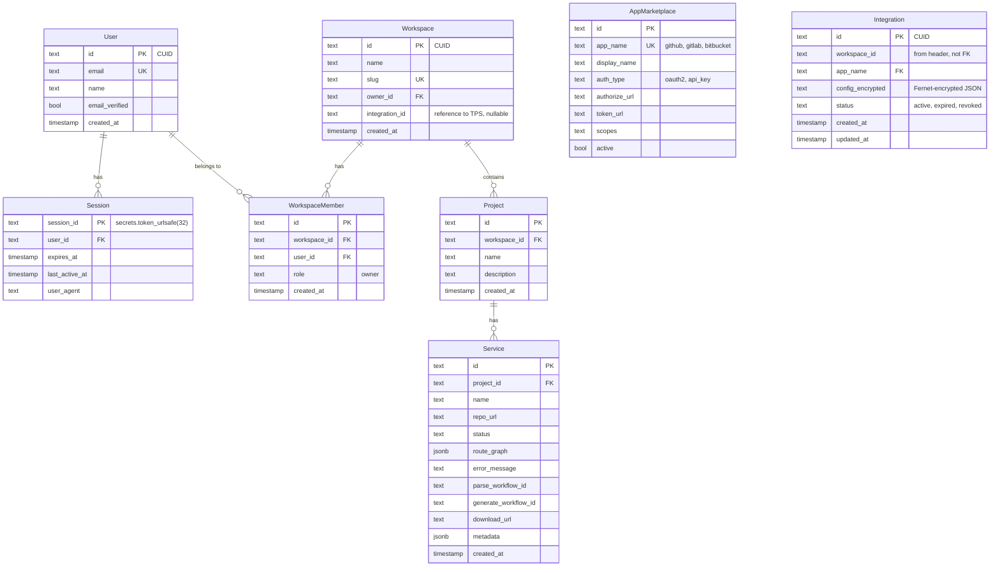

# feat: Backend Auth — Core + TPS Two-Service Architecture

## Overview

Replace the broken Auth.js frontend auth with two Python FastAPI backend services following the Atomicwork ESD ↔ TPS pattern. Core Service handles platform auth and business logic. TPS Service handles third-party OAuth and token management. If TPS goes down, users can still log in and use the dashboard.

## Problem Statement

Auth.js v5 in Next.js failed due to oauth4webapi's strict OIDC `iss` validation rejecting GitHub's callback parameters. Beyond the bug, the architecture was wrong: frontend handling OAuth tokens, tight coupling between platform login and repo access, no extensibility for GitLab/Bitbucket.

## Proposed Solution

### Architecture

```
Next.js (:3000) → Core (:8000) → TPS (:8001)
     │                  │               │
  Thin proxy      Platform auth    OAuth handlers
  to Core         User/workspace   Token encryption
                  Service CRUD     Auto-refresh
                  Session mgmt     Repo cloning proxy
```

### Two Services

**Core Service (:8000)** — Platform auth + business logic
- Email magic link authentication (itsdangerous signed tokens)
- Server-side sessions (PostgreSQL, httpOnly cookie)
- User, workspace, project, service CRUD
- Proxies integration calls to TPS with `X-Workspace-ID` header
- Works independently of TPS

**TPS Service (:8001)** — Third-party integrations
- App marketplace registry
- Pluggable OAuth handlers (GitHub MVP, GitLab/Bitbucket/Gitpod later)
- Fernet-encrypted token storage
- Auto-refresh on token access
- Repo clone proxy with authenticated credentials

### Data Model



### Key Technical Decisions

**Magic link auth (itsdangerous signed tokens):**
- `itsdangerous.URLSafeTimedSerializer` generates signed tokens with 15-min TTL
- Stateless — no DB table for tokens, token encodes email + timestamp + signature
- Unified flow: POST `/auth/magic-link` with email → always returns 200 (prevents enumeration)
- On verify: get-or-create user, create session, set httpOnly cookie

**Server-side sessions (PostgreSQL):**
- `sessions` table: session_id (token_urlsafe), user_id, expires_at, last_active_at
- 7-day expiry with rolling window (extends on activity)
- Cookie: `httpOnly=true`, `secure=true`, `sameSite=lax`
- `SameSite=Lax` provides CSRF protection (blocks cross-origin POST)

**Fernet encryption for TPS tokens:**
- `cryptography.fernet.Fernet` with key from env var `FERNET_KEY`
- Integration config stored as encrypted JSON blob in `config_encrypted` column
- Decrypt only when needed (on clone, on refresh check)
- Key rotation via `MultiFernet` (new key encrypts, both keys decrypt)

**OAuth callback routing:**
- Callback URL registered with GitHub: `{APP_URL}/api/integrations/github/callback`
- Next.js route → proxies to Core → Core forwards to TPS with `X-Workspace-ID`
- TPS exchanges code, encrypts token, returns `integration_id`
- Core stores `integration_id` on workspace record

**Service-to-service auth (MVP):**
- Shared secret in `X-TPS-Secret` header between Core/Worker and TPS
- TPS validates the header on every request
- Same Docker network, no mTLS for MVP

## Implementation Phases

### Phase 1: Core Service — Auth + User Management

**Tasks:**

- [ ] Create `services/core/` directory with FastAPI app structure
- [ ] Install deps: `fastapi`, `uvicorn`, `sqlmodel`, `asyncpg`, `itsdangerous`, `httpx`, `pydantic-settings`
- [ ] Define Core DB models: `User`, `Session`, `Workspace`, `WorkspaceMember`, `Project`, `Service`
- [ ] Create SQLModel migration (or Alembic) for core schema
- [ ] Implement magic link auth:
  - `POST /auth/magic-link` — generates signed token, sends email (log to console for MVP)
  - `GET /auth/verify?token=xxx` — verifies token, get-or-create user, auto-create workspace + project, create session, set cookie
  - `GET /auth/session` — returns current user from session cookie
  - `POST /auth/logout` — deletes session
- [ ] Implement session middleware: validate session cookie on every request, reject expired sessions
- [ ] Implement `get_current_user` dependency for protected routes
- [ ] Implement workspace/project/service CRUD endpoints:
  - `GET /workspaces/current` — current user's workspace
  - `POST /projects`, `GET /projects`, `DELETE /projects/{id}`
  - `POST /services`, `GET /services/{id}`, `DELETE /services/{id}`
  - `GET /services/{id}/status` — SSE endpoint (same pattern as before)
- [ ] Add Core to docker-compose.yml on port 8000

**Files:**
```
services/core/
  main.py                 # FastAPI app + lifespan
  config.py               # pydantic-settings config
  models.py               # SQLModel entities
  deps.py                 # get_current_user, get_db
  auth/
    magic_link.py          # itsdangerous token create/verify
    session.py             # session CRUD
    routes.py              # /auth/* endpoints
  routes/
    workspaces.py
    projects.py
    services.py
  tps_client.py            # httpx client for calling TPS
```

**Success criteria:**
- [ ] `POST /auth/magic-link` returns 200 and logs the magic link URL
- [ ] `GET /auth/verify?token=xxx` creates user + workspace, sets session cookie
- [ ] Protected routes return 401 without valid session cookie
- [ ] CRUD endpoints work with session auth

### Phase 2: TPS Service — App Marketplace + GitHub Handler

**Tasks:**

- [ ] Create `services/tps/` directory with FastAPI app structure
- [ ] Install deps: `fastapi`, `uvicorn`, `sqlmodel`, `asyncpg`, `cryptography`, `httpx`
- [ ] Define TPS DB models: `AppMarketplace`, `Integration`
- [ ] Seed app_marketplace with GitHub entry (authorize_url, token_url, default scopes)
- [ ] Implement `AppHandler` Protocol:
  ```python
  class AppHandler(Protocol):
      def get_authorize_url(self, workspace_id: str, redirect_uri: str) -> tuple[str, str]: ...
      async def exchange_code(self, code: str) -> dict: ...
      async def refresh_token(self, config: dict) -> dict: ...
      def is_token_expired(self, config: dict) -> bool: ...
  ```
- [ ] Implement `GithubHandler`:
  - `get_authorize_url()` — returns GitHub OAuth URL with state param + `repo` scope
  - `exchange_code()` — POST to github.com/login/oauth/access_token, return token dict
  - `refresh_token()` — GitHub tokens don't expire by default, return config as-is
  - `is_token_expired()` — returns False for GitHub
- [ ] Implement Fernet encryption: `encrypt_config()` / `decrypt_config()` utilities
- [ ] Implement integration endpoints:
  - `GET /apps` — list available apps from marketplace
  - `POST /integrations/{app}/install` — returns OAuth authorize URL
  - `GET /integrations/{app}/callback?code=xxx&state=yyy` — exchanges code, encrypts + stores token, returns integration_id
  - `GET /integrations` — list workspace's integrations (filtered by `X-Workspace-ID` header)
  - `DELETE /integrations/{id}` — revoke and delete integration
  - `POST /integrations/{id}/clone` — clone a repo using the integration's token
- [ ] Implement `X-TPS-Secret` header validation middleware
- [ ] Implement `get_or_refresh()` — decrypt config, check expiry, refresh if needed, return usable token
- [ ] Add TPS to docker-compose.yml on port 8001

**Files:**
```
services/tps/
  main.py                 # FastAPI app
  config.py               # pydantic-settings config
  models.py               # SQLModel entities (AppMarketplace, Integration)
  crypto.py               # Fernet encrypt/decrypt
  deps.py                 # get_workspace_id from header
  handlers/
    __init__.py            # handler_registry dict
    base.py                # AppHandler Protocol
    github.py              # GithubHandler
  routes/
    apps.py                # /apps endpoints
    integrations.py        # /integrations/* endpoints
  integration_service.py   # get_or_refresh, CRUD logic
```

**Success criteria:**
- [ ] `GET /apps` returns GitHub in the marketplace
- [ ] `POST /integrations/github/install` returns a valid GitHub OAuth URL
- [ ] OAuth callback stores encrypted token and returns integration_id
- [ ] `POST /integrations/{id}/clone` clones a public repo successfully
- [ ] `X-TPS-Secret` header required on all endpoints

### Phase 3: Wire Everything Together

**Tasks:**

- [ ] Update Next.js: remove Auth.js entirely (delete auth.ts, middleware.ts, [...nextauth] route)
- [ ] Create Next.js proxy routes:
  - `/api/auth/*` → proxy to Core :8000
  - `/api/workspaces/*` → proxy to Core :8000
  - `/api/projects/*` → proxy to Core :8000
  - `/api/services/*` → proxy to Core :8000
  - `/api/integrations/*` → proxy to Core :8000 (Core proxies to TPS)
- [ ] Update Next.js pages to use new auth flow:
  - Landing page: email input → call `/api/auth/magic-link` → "check your email" message
  - Magic link click: `/auth/verify?token=xxx` → redirect to dashboard
  - Dashboard: fetch session from `/api/auth/session`
- [ ] Add "Connect GitHub" button to settings page → triggers OAuth flow via Core → TPS
- [ ] Implement Core `tps_client.py`: httpx client that forwards integration calls to TPS with `X-Workspace-ID` + `X-TPS-Secret` headers
- [ ] Update Temporal worker `clone_repo_activity`:
  - Takes `integration_id` instead of raw token
  - Calls TPS `POST /integrations/{id}/clone` to get authenticated clone
  - TPS handles token decryption and refresh
- [ ] Update docker-compose.yml: add Core and TPS services
- [ ] Add `services/core/.env.example` and `services/tps/.env.example`

**Success criteria:**
- [ ] Full flow works: email → magic link → login → connect GitHub → parse repo → see mindmap → generate → download
- [ ] TPS down: login + dashboard + view existing data all work, parse returns 502
- [ ] Next.js only talks to Core, never to TPS
- [ ] Temporal worker calls TPS for clone, not Core

## Acceptance Criteria

### Functional
- [ ] Email magic link login works end-to-end
- [ ] Server-side sessions with httpOnly cookie
- [ ] GitHub OAuth connection via TPS
- [ ] Encrypted token storage (Fernet)
- [ ] Repo parsing works with TPS-provided clone
- [ ] Service CRUD with workspace scoping

### Non-Functional
- [ ] Core responds in <100ms for auth endpoints
- [ ] TPS responds in <200ms for token operations (excluding GitHub API latency)
- [ ] Session cookie: httpOnly, secure, sameSite=lax
- [ ] CSRF protection via SameSite=Lax
- [ ] Magic link tokens expire in 15 minutes
- [ ] Sessions expire in 7 days with rolling window
- [ ] TPS validates X-TPS-Secret on every request

### Security
- [ ] Magic link: always return 200 (no email enumeration)
- [ ] Magic link: cryptographically signed (itsdangerous)
- [ ] Tokens encrypted at rest (Fernet)
- [ ] OAuth state parameter validated on callback
- [ ] Core never stores third-party tokens
- [ ] TPS accessible only via shared secret

## Tech Stack

| Component | Technology | Version |
|-----------|-----------|---------|
| Core framework | FastAPI | >=0.115.0 |
| TPS framework | FastAPI | >=0.115.0 |
| ORM | SQLModel | >=0.0.22 |
| Async DB driver | asyncpg | >=0.30.0 |
| Magic link tokens | itsdangerous | ==2.2.0 |
| Session middleware | custom (PostgreSQL) | - |
| Token encryption | cryptography (Fernet) | >=44.0.0 |
| HTTP client | httpx | >=0.28.0 |
| Settings | pydantic-settings | >=2.7.0 |
| Email (MVP) | Console log | - |

## File Structure

```
genalphacli/
  src/genalphacli/           # Existing CLI (unchanged)
  services/
    core/                    # Core Service (:8000)
      main.py
      config.py
      models.py
      deps.py
      auth/
        magic_link.py
        session.py
        routes.py
      routes/
        workspaces.py
        projects.py
        services.py
      tps_client.py
    tps/                     # TPS Service (:8001)
      main.py
      config.py
      models.py
      crypto.py
      deps.py
      handlers/
        __init__.py
        base.py
        github.py
      routes/
        apps.py
        integrations.py
      integration_service.py
  worker/                    # Temporal worker (updated)
  web/                       # Next.js frontend (updated)
  docker-compose.yml         # Updated: + core + tps
```

## References

- Brainstorm: `docs/design/brainstorms/2026-04-10-backend-auth-layer-brainstorm.md`
- TPS pattern reference: `/Users/nandisha/Desktop/Atomicwork/third-party-app-integration/`
- ESD pattern reference: `/Users/nandisha/Desktop/Atomicwork/esd/`
- [itsdangerous docs](https://itsdangerous.palletsprojects.com/)
- [cryptography Fernet docs](https://cryptography.io/en/latest/fernet/)
- [GitHub OAuth web flow](https://docs.github.com/en/apps/oauth-apps/building-oauth-apps/authorizing-oauth-apps)
