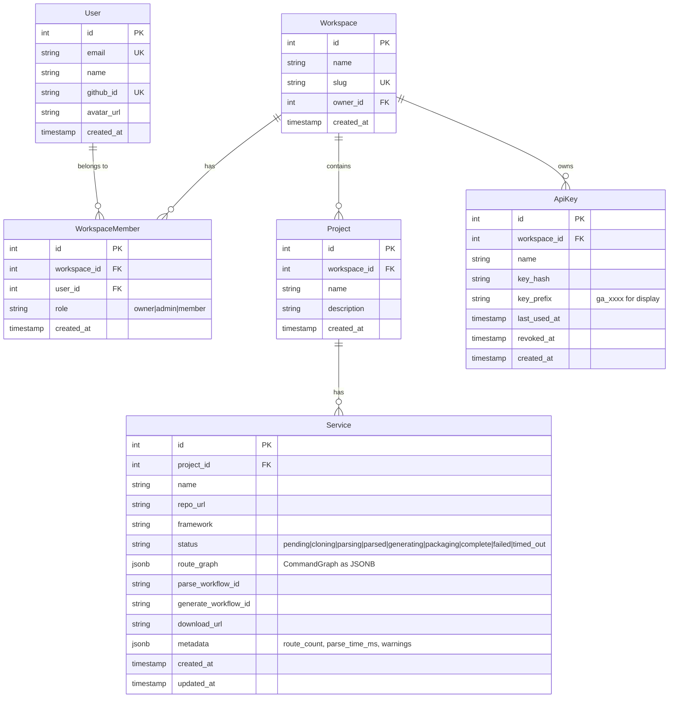

# feat: GenAlpha Web App Platform

## Enhancement Summary

**Deepened on:** 2026-04-10
**Sections enhanced:** 8
**Review agents used:** Security Sentinel, Architecture Strategist, Performance Oracle, Code Simplicity Reviewer, Frontend Design, Python Reviewer

### Key Improvements
1. **Security: GitHub token stored in DB, not JWT** — prevents XSS token theft (Critical)
2. **Security: UUIDs for all resource IDs** — prevents enumeration attacks
3. **Performance: DB-based status polling** — eliminates Temporal query bottleneck for SSE
4. **Architecture: Deterministic workflow IDs** — free idempotency via `parse-{serviceId}`
5. **Python: Plain `def` activities with dataclass I/O** — correct Temporal SDK pattern
6. **Frontend: Dark developer-tool aesthetic** — monospace accents, method-colored nodes
7. **Architecture: Remove `finalize` activity** — Next.js owns all DB writes
8. **Architecture: Merge worker deps into root pyproject.toml** — no separate package

### New Considerations Discovered
- Authorization middleware must be explicit on EVERY endpoint (not just download)
- Don't pass GitHub tokens through Temporal — worker retrieves from DB by user_id
- Keep `atexit` handler in github.py (safety net for crashed workers)
- SSE must emit current state on connect (handles reconnection + late-joining)
- React Flow nodes must be memoized (`React.memo`) to prevent render jank
- Separate Temporal task queues for parse (concurrency=5) vs generate (concurrency=20)
- API Keys phase (Phase 5) can be deferred post-MVP without losing core value

---

## Overview

Build a multi-tenant developer SaaS web app on top of the existing genalphacli CLI tool. Users sign in with GitHub, paste a repo URL, see parsed API routes visualized as a mindmap, configure output, and download generated CLI/MCP packages — all through the browser.

The existing Python pipeline (parsers, generators, models) is fully reusable. The web app adds: Next.js frontend, Temporal workflow orchestration, PostgreSQL persistence, GitHub OAuth, and a React Flow mindmap visualization.

## Problem Statement

GenAlpha CLI works great from the terminal, but:
- Requires local installation and Python/uv knowledge
- No way to save or revisit past parses
- No visual exploration of parsed API structure
- No team sharing or programmatic access
- Limited audience — only developers comfortable with CLI tools

A web app makes API-to-CLI/MCP generation accessible to any developer with a browser, adds persistence, and creates the foundation for a multi-tenant developer platform.

## Proposed Solution

### Architecture

```
┌─────────────────────────────────────────────────────────────┐
│  NEXT.JS 15 (web/)                                           │
│  ┌──────────────┐  ┌──────────────┐  ┌───────────────────┐ │
│  │ React UI     │  │ API Routes   │  │ Auth.js v5        │ │
│  │ App Router   │  │ /api/parse   │  │ GitHub OAuth      │ │
│  │ React Flow   │──│ /api/status  │──│ JWT sessions      │ │
│  │ (mindmap)    │  │ /api/download│  │                   │ │
│  └──────────────┘  │ /api/keys    │  └───────────────────┘ │
│                     └──────┬───────┘                        │
└────────────────────────────┼────────────────────────────────┘
                             │ @temporalio/client
                             ▼
┌─────────────────────────────────────────────────────────────┐
│  TEMPORAL SERVER (Docker Compose)                            │
│  ┌────────────────────────┐  ┌────────────────────────┐    │
│  │ ParseWorkflow          │  │ GenerateWorkflow        │    │
│  │  1. clone_repo         │  │  1. generate_packages   │    │
│  │  2. detect_framework   │  │  2. package_zip         │    │
│  │  3. parse_routes       │  │  3. finalize            │    │
│  │  → returns graph.json  │  │  → returns download_url │    │
│  └────────────────────────┘  └────────────────────────┘    │
└─────────────────────────────────────────────────────────────┘
                             │
┌────────────────────────────┼────────────────────────────────┐
│  PYTHON TEMPORAL WORKER (src/genalphacli/ + worker/)         │
│  Existing: pipeline.py, parsers/, generators/, github.py     │
│  New: worker.py, activities.py, workflow definitions          │
└─────────────────────────────────────────────────────────────┘
                             │
                     ┌───────┴───────┐
                     │  PostgreSQL   │
                     │  (Drizzle ORM)│
                     └───────────────┘
```

### Key Architectural Decision: Two Workflows, Not One

The pipeline splits into **two Temporal workflows** to support the human-in-the-loop mindmap review step:

1. **ParseWorkflow** — Clone → Detect → Parse → Return graph.json → Done
2. **GenerateWorkflow** — Generate CLI/MCP → Package zip → Return download URL → Done

Between the two workflows, the user reviews the parsed routes in the mindmap visualization and configures output options. This is cleaner than using Temporal signals because:
- No workflow waiting indefinitely for human input
- Each workflow is short-lived and deterministic
- The graph.json in the DB serves as the handoff artifact
- User can revisit the parsed graph anytime without a running workflow

### Research Insights: Architecture

**Idempotency via deterministic workflow IDs:**
- Use `parse-{serviceId}` and `generate-{serviceId}` as Temporal workflow IDs (not random UUIDs)
- Temporal rejects duplicate workflow IDs, providing free deduplication against double-clicks or network retries

**Next.js owns ALL database writes:**
- The Python Temporal worker should NOT write to PostgreSQL directly
- Workflows return results; Next.js API routes poll for completion and update the DB
- This avoids maintaining two DB connection layers and keeps Drizzle as the single ORM
- Remove the `finalize` activity from GenerateWorkflow — it returns the zip path, Next.js updates the service record

**Temporal client in Next.js constraints:**
- The `@temporalio/client` connection is gRPC-based and must persist across requests
- Next.js must run as a persistent Node.js process (`next start`), NOT serverless/edge
- Add circuit breaker: if Temporal is unreachable, return 503 "try again shortly" (not an unhandled gRPC error)

**Don't pass GitHub tokens through Temporal:**
- Temporal stores workflow inputs in its own DB in plaintext
- Pass `user_id` to the workflow; the worker activity retrieves the token from PostgreSQL (via a direct DB read or a shared secrets service)

**Worker dependency management:**
- Do NOT create a separate `worker/pyproject.toml`
- Add `temporalio` as an optional dependency group in root `pyproject.toml`: `[dependency-groups] worker = ["temporalio>=1.25.0"]`
- Worker imports `genalphacli` directly from `src/` — single package, no cross-package coordination

**Separate task queues for resource isolation:**
```
parse-queue:  max_concurrent_activities=5  (clone is I/O-heavy, disk-intensive)
generate-queue: max_concurrent_activities=20 (generation is lightweight)
```

### Data Model



### Service State Machine

```
                    ┌─────────┐
                    │ pending  │
                    └────┬─────┘
                         │ Start ParseWorkflow
                    ┌────▼─────┐
              ┌─────│ cloning  │─────┐
              │     └────┬─────┘     │ fail/timeout
              │          │           ▼
              │     ┌────▼─────┐  ┌──────┐
              │     │ parsing  │  │failed│
              │     └────┬─────┘  └──────┘
              │          │           ▲
              │     ┌────▼─────┐     │
              │     │ parsed   │─────┘ (if generation fails)
              │     └────┬─────┘
              │          │ User clicks "Generate"
              │     ┌────▼──────┐
              │     │generating │
              │     └────┬──────┘
              │          │
              │     ┌────▼──────┐
              │     │ packaging │
              │     └────┬──────┘
              │          │
              │     ┌────▼──────┐
              └────►│ complete  │
                    └───────────┘
```

**Counting rules:** Only `parsed`, `generating`, `packaging`, and `complete` services count toward the 2-service limit. `pending`, `cloning`, `parsing`, `failed`, and `timed_out` do not. Users can delete any service at any time to free up slots.

### Research Insights: Data Model & Security

**Use UUIDs, not sequential integers:**
- Change all `int id PK` to `string id PK` with CUID or UUID v4 generation
- Sequential IDs enable enumeration attacks (user A guesses user B's service ID)
- Drizzle: use `text('id').primaryKey().$defaultFn(() => createId())` with `@paralleldrive/cuid2`

**Add `error_message` column to Service:**
- When status is `failed`, users need to know why
- Add `error_message text` alongside `status` (clearer than burying it in metadata JSONB)

**Add missing state transitions:**
- `complete → generating` — re-generate with different options (CLI instead of MCP)
- `parsed → pending` — re-parse when upstream repo changes
- Add `timed_out` transitions from all active states (cloning, parsing, generating, packaging)

**Authorization middleware pattern (CRITICAL):**
- EVERY endpoint must verify ownership: `assertOwnership(session.user.id, resource.workspaceId)`
- Create a reusable middleware/helper, not per-route ad-hoc checks
- Write integration tests that specifically verify cross-tenant access is denied

**GitHub OAuth token storage:**
- Do NOT store the access token in the JWT — XSS would exfiltrate it
- Use Auth.js database session strategy (Prisma/Drizzle adapter) → token stored encrypted in `accounts` table
- Or: use JWT sessions but store only session ID, look up token server-side

**Database indexes (CRITICAL — PostgreSQL does NOT auto-create FK indexes):**
```sql
CREATE INDEX idx_workspace_members_user_id ON workspace_members(user_id);
CREATE INDEX idx_projects_workspace_id ON projects(workspace_id);
CREATE INDEX idx_services_project_id ON services(project_id);
CREATE INDEX idx_services_project_status ON services(project_id, status);
CREATE INDEX idx_api_keys_key_hash ON api_keys(key_hash) WHERE revoked_at IS NULL;
CREATE INDEX idx_services_parse_workflow ON services(parse_workflow_id);
```

**Scoped query helper for tenant isolation:**
```typescript
// Every query goes through this — prevents accidental cross-tenant leaks
function scopedQuery(workspaceId: string) {
  return {
    services: () => db.query.services.findMany({
      where: eq(services.workspaceId, workspaceId)
    }),
    // ... other scoped queries
  }
}
```

**Exclude `route_graph` from list queries:**
- On dashboard/list pages, SELECT specific columns (id, name, status, metadata) — never load the full JSONB blob
- A 50-route graph is 50-150KB; loading 10 services on a list = 0.5-1.5MB wasted I/O

## Technical Approach

### Implementation Phases

#### Phase 1: Foundation (Infrastructure + Auth)

Set up the monorepo structure, database, Temporal, and authentication.

**Tasks:**

- [ ] Create `web/` directory with Next.js 15 App Router (`npx create-next-app@latest web`)
- [ ] Set up Docker Compose: Temporal server + UI + PostgreSQL
- [ ] Configure Drizzle ORM with PostgreSQL schema (users, workspaces, workspace_members, projects, services, api_keys tables)
- [ ] Run initial migration: `npx drizzle-kit generate && npx drizzle-kit migrate`
- [ ] Set up Auth.js v5 with GitHub OAuth provider
  - Route handler: `web/app/api/auth/[...nextauth]/route.ts`
  - Config: `web/auth.ts` with GitHub provider, JWT strategy
  - Scopes: `read:user user:email` (add `repo` scope on-demand for private repos)
  - Persist GitHub access token in encrypted JWT
- [ ] Middleware for protected routes: `web/middleware.ts`
- [ ] Auto-create workspace + default project on first login (callback in Auth.js)
- [ ] Create Temporal client singleton: `web/lib/temporal.ts`
- [ ] Create Python Temporal worker skeleton: `worker/worker.py`
- [ ] Add `temporalio` to `pyproject.toml` dependencies

**Files:**

```
web/
  app/
    api/auth/[...nextauth]/route.ts
    layout.tsx
    page.tsx                         # Landing page
  auth.ts                            # Auth.js config
  middleware.ts                      # Route protection
  lib/
    temporal.ts                      # Temporal client singleton
    db.ts                            # Drizzle client
  db/
    schema.ts                        # Drizzle schema
    migrations/                      # Generated migrations
  package.json
  next.config.ts
  drizzle.config.ts
worker/
  worker.py                          # Temporal worker entrypoint
  workflows/
    __init__.py
    parse_workflow.py
    generate_workflow.py
  activities/
    __init__.py
    github_activities.py
    parse_activities.py
    generate_activities.py
  pyproject.toml                     # Worker-specific deps (temporalio)
docker-compose.yml                   # Temporal + Postgres + Temporal UI
```

**Success criteria:**
- [ ] `docker compose up` starts Temporal + Postgres + Temporal UI
- [ ] Next.js app runs on localhost:3000
- [ ] GitHub OAuth login/logout works
- [ ] First login auto-creates workspace + project
- [ ] Database tables created via Drizzle migration
- [ ] Python Temporal worker connects to Temporal server

**Research Insights: Phase 1**

- Auth.js v5 env vars use `AUTH_` prefix (not `NEXTAUTH_`): `AUTH_SECRET`, `AUTH_GITHUB_ID`, `AUTH_GITHUB_SECRET`
- Start with `read:user user:email` scopes; prompt for `repo` scope only when private repo clone fails (reduces signup friction)
- Use `await cookies()` and `await headers()` in Next.js 15 — synchronous access is deprecated
- Add security headers in `next.config.ts`: CSP, X-Content-Type-Options, X-Frame-Options, Referrer-Policy
- Temporal UI should bind to localhost only — it exposes all workflow data including inputs

#### Phase 2: Parse Pipeline (Core Value)

Wire up the parsing workflow — from GitHub URL to graph.json stored in DB.

**Tasks:**

- [ ] Implement `ParseWorkflow` in `worker/workflows/parse_workflow.py`:
  - Activity 1: `clone_repo` — validates URL (SSRF check), clones to per-user temp dir, returns path
  - Activity 2: `detect_framework` — calls existing `detect_framework()`
  - Activity 3: `parse_routes` — calls existing `run_pipeline()`, returns `CommandGraph.model_dump()`
  - Cleanup: `finally` block deletes cloned repo temp dir
  - Status tracking: workflow `@workflow.query` for `get_status` returning current step + metadata
- [ ] Implement activities in `worker/activities/`:
  - `github_activities.py`: `clone_repo_activity()` wrapping existing `github.py` functions
  - `parse_activities.py`: `parse_routes_activity()` wrapping `pipeline.run_pipeline()`
  - Per-user temp dir isolation: `/tmp/genalphacli/{user_id}/{workflow_id}/`
  - Retry policy: 3 attempts for clone (network flaky), 1 attempt for parse (deterministic)
  - Timeouts: clone 120s, parse 180s (within 5 min total limit)
  - Heartbeats on clone activity (long-running git operation)
- [ ] Refactor `github.py`: remove `atexit` cleanup and module-level `_temp_dirs` list; add explicit `cleanup_clone_dir(path)` function
- [ ] API route: `POST /api/parse` — validates input, checks service limit (2 per workspace), creates Service record (status=pending), starts ParseWorkflow, returns workflowId
- [ ] API route: `GET /api/workflows/[workflowId]/status` — SSE endpoint querying Temporal workflow status, streams step-by-step progress
- [ ] API route: `GET /api/services/[serviceId]` — returns service with route_graph
- [ ] Frontend: parse form page with GitHub URL input + live progress stepper
- [ ] Frontend: `useWorkflowStatus` hook consuming SSE EventSource
- [ ] Progress UI: step indicators (Cloning... ✓ → Parsing... ✓ → Done!)
- [ ] On parse completion: store `CommandGraph` as JSONB in services.route_graph, update status to `parsed`

**Security enforcement:**
- [ ] URL validation: strict `https://github.com/{owner}/{repo}` regex (reuse existing `GITHUB_URL_RE` from `github.py`)
- [ ] SSRF: reject non-GitHub URLs at API layer before workflow starts
- [ ] Repo size: shallow clone with `--depth 1`, check size before full clone
- [ ] Temp dir: per-user isolation, 0700 permissions, cleanup in finally block + hourly sweep cron

**Success criteria:**
- [ ] User pastes public GitHub repo URL → sees live progress → graph.json stored in DB
- [ ] Service status updates in real-time via SSE
- [ ] Failed/timed-out parses show clear error messages
- [ ] Temporal UI shows workflow execution history
- [ ] Cloned repos are cleaned up after completion/failure

**Research Insights: Phase 2 (Temporal Python Worker)**

**Activity definitions — use plain `def`, not `async def`:**
```python
@activity.defn
def clone_repo_activity(input: CloneRepoInput) -> CloneRepoOutput:
    # Temporal runs sync activities in a thread pool automatically
    info = fetch_repo_info(input.owner, input.repo, token=token)
    clone_dir = clone_repo(info, token=token)
    return CloneRepoOutput(clone_dir=str(clone_dir))
```

**Define dataclass schemas for all activity I/O (not Pydantic):**
```python
@dataclass
class CloneRepoInput:
    owner: str
    repo: str
    user_id: str       # NOT the token — worker looks it up
    workflow_id: str

@dataclass
class ParseRoutesOutput:
    route_graph: dict   # CommandGraph.model_dump() — never pass Pydantic through Temporal
    route_count: int
    parse_time_ms: int
```

**Hard rule: never pass Pydantic models through Temporal — always `model_dump()` / `model_validate()` at boundaries.**

**Keep `atexit` handler in github.py:**
- Do NOT remove it — it's a safety net for crashed workers
- Add optional `target_dir: Path | None` parameter to `clone_repo()` for worker use
- The existing `cleanup_clone()` at line 268 already exists — reference it, don't create a new one

**SSE status polling — use DB, not Temporal queries:**
- Worker updates `services.status` in DB after each activity via a callback to Next.js
- SSE endpoint reads from PostgreSQL (indexed SELECT) instead of hitting Temporal
- This eliminates Temporal query bottleneck (180 queries per 3-min workflow per user)
- SSE must emit current state immediately on connect (handles reconnection + late-joining)
- Stop SSE stream on terminal states (`parsed`, `complete`, `failed`, `timed_out`)
- Set `Cache-Control: no-cache` and `X-Accel-Buffering: no` headers on SSE responses

**Rate limiting for browser sessions too:**
- 10 parses/hour per user (same as API key limit)
- Without this, any GitHub account holder can DoS the worker pool

**Temp directory — use `tempfile.mkdtemp()`, not predictable paths:**
- `/tmp/genalphacli/{user_id}/` is predictable and vulnerable to symlink attacks
- Use `tempfile.mkdtemp(prefix="genalpha-")` with 0700 permissions
- Map back to user via Temporal workflow input, not filesystem path
- Skip heartbeats on clone for MVP — use generous 120s timeout instead

#### Phase 3: Mindmap Visualization + Generation

Display parsed routes as an interactive mindmap, let user configure and generate packages.

**Tasks:**

- [ ] Install React Flow: `npm install @xyflow/react @dagrejs/dagre`
- [ ] Build `RouteGraph` component (`web/components/route-graph.tsx`):
  - Convert `CommandGraph.subcommands` to React Flow nodes/edges
  - Group by URL path prefix (e.g., `/users/*`, `/projects/*` as parent nodes)
  - Color-code by HTTP method (GET=green, POST=blue, PUT=orange, DELETE=red)
  - Custom `ApiRouteNode` component showing method, path, param count
  - Dagre auto-layout (top-down tree)
  - Controls, MiniMap, Background components
  - `fitView` for initial viewport
- [ ] Build service detail page (`web/app/dashboard/services/[serviceId]/page.tsx`):
  - Shows mindmap of parsed routes
  - Route metadata panel (click a node → see params, response type, description)
  - "Generate" button with output type selector (CLI / MCP / Both)
  - CLI name input (defaulted from repo name)
  - Base URL input (pre-filled from config detection)
- [ ] Implement `GenerateWorkflow` in `worker/workflows/generate_workflow.py`:
  - Input: service_id, output_types (cli/mcp/both), cli_name, base_url
  - Activity 1: `generate_packages` — loads graph from input, calls existing generators
  - Activity 2: `package_zip` — zips generated package(s) into single zip, stores on disk
  - Activity 3: `finalize` — updates service record with download_url, status=complete
  - Status tracking via `@workflow.query`
- [ ] API route: `POST /api/generate` — validates config, starts GenerateWorkflow, returns workflowId
- [ ] API route: `GET /api/services/[serviceId]/download` — validates ownership, serves zip with proper Content-Disposition header, signed time-limited check
- [ ] Generation progress UI reusing the SSE stepper pattern
- [ ] Zip contents: generated package + README with install/usage instructions

**Success criteria:**
- [ ] Parsed routes display as interactive mindmap
- [ ] Clicking a route node shows its details (params, method, response)
- [ ] User selects CLI/MCP/both → generation runs → zip download works
- [ ] Download only accessible to the authenticated service owner
- [ ] Generated packages match what the CLI tool produces

**Research Insights: Phase 3 (Mindmap + UI Design)**

**Visual aesthetic — dark developer-tool theme:**
- Background: zinc-950 base, zinc-900 surfaces, zinc-800 elevated
- Typography: JetBrains Mono / IBM Plex Mono for route paths + headings, Satoshi/Geist Sans for body
- One accent color for interactive elements (cyan-400 or teal-400)
- Method colors: GET=emerald-400, POST=blue-400, PUT=amber-400, DELETE=rose-400, PATCH=violet-400

**React Flow node design:**
- Compact card: method badge (colored pill) left, route path monospace right, param count bottom-right
- Node background: zinc-800 with 4px left border in method color
- Selected: brighter border, 1.02x scale, subtle glow in method color
- **Wrap `ApiRouteNode` in `React.memo()`** — prevents render jank with 50+ nodes
- Define `nodeTypes` object OUTSIDE the component (React Flow re-renders all nodes otherwise)

**Layout and interaction:**
- Dagre layout: `rankdir: TB`, `nodesep: 60`, `ranksep: 100`
- Click node → slide-in right panel (360px) with details (NOT a modal)
- Hover node → highlight connected edges, dim all others
- `fitView` with 50px padding on initial render
- Lazy load React Flow with `next/dynamic({ ssr: false })` — saves 150KB from initial bundle

**Large graph handling (100+ routes):**
- Collapse path-prefix groups by default when >100 routes
- Run dagre layout in a Web Worker when >100 nodes
- React Flow has built-in viewport culling — verify `onlyRenderVisibleElements` is enabled

**Download authorization — session check, not signed URLs:**
- Require valid session on every download request
- Check `service.workspaceId === currentUser.workspaceId` in the handler
- On service deletion, delete the zip file from disk immediately
- Signed URLs are harder to revoke and can leak via browser history/Slack

**Service detail page layout:**
- Top bar: service name, repo URL, status badge, framework, route count
- Main area: mindmap (100% width, min 60vh height)
- Bottom drawer (collapsible, 280px): generation config triggered by floating "Generate" button
- Output type: segmented control (CLI / MCP / Both) — not dropdown
- After generation, download button persists in page header (not just in drawer)

#### Phase 4: Dashboard + Service Management

Build the workspace/project/service management UI.

**Tasks:**

- [ ] Dashboard layout (`web/app/dashboard/layout.tsx`): sidebar with workspace name, project list, settings link
- [ ] Dashboard home (`web/app/dashboard/page.tsx`): project list with service counts, recent activity
- [ ] Project page (`web/app/dashboard/projects/[projectId]/page.tsx`): service list with status badges, "Add Service" button, service limit indicator (X/2)
- [ ] Service list items: name, repo URL, status badge, route count, created date, actions (view, re-download, delete)
- [ ] Delete service flow: confirmation dialog → API call → remove record → free up slot
- [ ] Delete project flow: confirmation → cascade delete services → remove record
- [ ] API routes for CRUD: `POST/GET/DELETE /api/projects`, `DELETE /api/services/[id]`
- [ ] Empty states: no projects → "Create your first project", no services → "Add a service by pasting a GitHub URL"
- [ ] Workspace settings page: workspace name, member list (MVP: just the owner)

**Success criteria:**
- [ ] Full CRUD for projects and services
- [ ] Service limit enforced (2 per workspace) with clear UI indicator
- [ ] Delete frees up service slots
- [ ] Empty states guide new users

#### Phase 5: API Keys + Programmatic Access

Add API key management for CI/CD and programmatic access.

**Tasks:**

- [ ] API key generation: `POST /api/keys` — generates random key, stores SHA-256 hash in DB, returns plain key ONCE
- [ ] Key format: `ga_` prefix + 32 random alphanumeric chars (e.g., `ga_a1b2c3d4...`)
- [ ] API key list: `GET /api/keys` — returns name, prefix, last_used_at, created_at (never the full key)
- [ ] API key revocation: `DELETE /api/keys/[id]` — sets revoked_at timestamp
- [ ] API key auth middleware: check `Authorization: Bearer ga_xxx` header, hash and lookup, reject if revoked
- [ ] API key settings page in dashboard UI: list keys, create new, revoke existing
- [ ] Show key only once on creation with copy button + warning
- [ ] Programmatic endpoints: `POST /api/v1/parse`, `GET /api/v1/status/:workflowId`, `GET /api/v1/download/:serviceId` — same logic as UI endpoints but API key auth
- [ ] Rate limiting: 10 parses/hour per API key
- [ ] Scope: API keys scoped to workspace, can only parse public repos (no GitHub token available)

**Success criteria:**
- [ ] Create API key → key shown once → can use in curl/scripts
- [ ] `curl -H "Authorization: Bearer ga_xxx" -X POST /api/v1/parse -d '{"repo_url":"..."}' ` works
- [ ] Revoked keys are immediately rejected
- [ ] API key users limited to public repos

**Research Insights: Phase 5**

**This phase can be deferred post-MVP** without losing core value. Nobody automates CI/CD against a product that doesn't exist yet. Build Phases 1-4 first, validate with users, then add programmatic access.

**When you do build it:**
- Use HMAC-SHA-256 with a server secret (not plain SHA-256) — if DB leaks, attacker can't verify keys
- Use constant-time comparison (`crypto.timingSafeEqual` in Node.js) for key hash lookups
- Update `last_used_at` asynchronously to avoid timing side channels
- Add a `scope` field for future use (e.g., `parse:write`, `read`)

## Alternative Approaches Considered

| Approach | Why Rejected |
|----------|-------------|
| Single Temporal workflow with signal for review step | Workflow would block indefinitely waiting for human input; complicates timeout/cleanup |
| Celery + Redis instead of Temporal | Less durable, no per-step resume, weaker visibility; user chose Temporal explicitly |
| Prisma ORM | Heavier (1.6MB bundle), requires codegen step; Drizzle is lighter and SQL-like for a solo dev |
| PostgreSQL RLS for multi-tenancy | Overkill for MVP; application-level scoping is simpler to debug and iterate |
| WebSocket instead of SSE | Bidirectional not needed; SSE is simpler, has browser reconnection built in |
| S3 for zip storage | Extra infra for MVP; local disk + signed download URLs sufficient to start |
| GitHub App instead of OAuth | More setup, better for org-level access; defer until teams/orgs feature |

## Acceptance Criteria

### Functional Requirements

- [ ] User can sign in with GitHub OAuth and land on a dashboard
- [ ] First login auto-creates workspace + default project
- [ ] User can paste a GitHub repo URL and see live parsing progress (SSE steps)
- [ ] Parsed routes display as interactive mindmap (React Flow, color-coded by method)
- [ ] User can select output type (CLI/MCP/both) and trigger generation
- [ ] Generated package downloads as a zip file
- [ ] User can manage projects and services (create, view, delete)
- [ ] 2-service limit per workspace is enforced with clear UI feedback
- [ ] API keys can be created, listed, and revoked
- [ ] Programmatic API works with API key authentication

### Non-Functional Requirements

- [ ] Parse workflow completes in <5 minutes for repos under 500MB
- [ ] SSE progress updates arrive within 2 seconds of step changes
- [ ] Download URLs are authenticated and user-scoped (no unauthorized access)
- [ ] GitHub URLs strictly validated (SSRF prevention)
- [ ] Cloned repos cleaned up within 1 hour of workflow completion
- [ ] Temporal workflows visible in Temporal UI for debugging

### Quality Gates

- [ ] All existing 94 tests continue to pass (no regressions)
- [ ] New API routes have integration tests
- [ ] Temporal workflows have unit tests using Temporal test environment
- [ ] Frontend components have basic smoke tests
- [ ] Ruff lint clean on all Python code
- [ ] ESLint clean on all TypeScript code

## Dependencies & Prerequisites

- **Temporal**: Docker Compose setup (temporal server, UI, PostgreSQL)
- **GitHub OAuth App**: Must be created at github.com/settings/developers with callback URL
- **PostgreSQL 16**: Running via Docker Compose
- **Node.js 18+**: For Next.js
- **Python 3.10+**: For Temporal worker (already required)

## Risk Analysis & Mitigation

| Risk | Impact | Mitigation |
|------|--------|------------|
| Temporal learning curve (deterministic workflow model) | 1-2 week delay | Start with simple parse workflow, add complexity incrementally |
| GitHub OAuth token expiry during workflow | Pipeline failure | Short workflows (<5 min), token validated at workflow start |
| Large repos exhausting disk | Worker crashes | 500MB limit, shallow clone, per-user temp dir isolation, cleanup |
| SSE connection drops | Users see stale progress | EventSource auto-reconnects, client polls on reconnect |
| Two-workflow handoff (parse → review → generate) | Data consistency | Graph stored in Postgres JSONB, workflow IDs on service record |

## Tech Stack Summary

| Layer | Technology | Version |
|-------|-----------|---------|
| Frontend | Next.js (App Router) | 15.x |
| Auth | Auth.js (NextAuth v5) | next-auth@5.x |
| ORM | Drizzle ORM | 0.39.x |
| Database | PostgreSQL | 16 |
| Orchestration | Temporal Server | latest (Docker) |
| Workflow client (TS) | @temporalio/client | 1.14.x |
| Workflow worker (Python) | temporalio | 1.25.x |
| Graph visualization | React Flow + dagre | @xyflow/react@12.x |
| Zip generation | Python zipfile (worker) | stdlib |
| Real-time updates | SSE (Next.js route handlers) | built-in |

## File Structure (Final)

```
genalphacli/
  src/genalphacli/          # Existing CLI + pipeline (unchanged)
  tests/                    # Existing tests (unchanged)
  web/                      # NEW: Next.js app
    app/
      page.tsx              # Landing page
      layout.tsx            # Root layout
      api/
        auth/[...nextauth]/route.ts
        parse/route.ts
        generate/route.ts
        services/[serviceId]/route.ts
        services/[serviceId]/download/route.ts
        workflows/[workflowId]/status/route.ts
        keys/route.ts
        keys/[keyId]/route.ts
        projects/route.ts
        projects/[projectId]/route.ts
        v1/                 # Programmatic API (API key auth)
          parse/route.ts
          status/[workflowId]/route.ts
          download/[serviceId]/route.ts
      dashboard/
        page.tsx            # Dashboard home
        layout.tsx          # Dashboard layout (sidebar)
        projects/
          [projectId]/page.tsx
        services/
          [serviceId]/page.tsx  # Mindmap + generate
        settings/
          page.tsx          # Workspace settings + API keys
    auth.ts
    middleware.ts
    lib/
      temporal.ts
      db.ts
    db/
      schema.ts
      migrations/
    components/
      route-graph.tsx       # React Flow mindmap
      api-route-node.tsx    # Custom node component
      progress-stepper.tsx  # SSE-driven progress UI
      service-card.tsx
      project-card.tsx
    hooks/
      use-workflow-status.ts  # SSE EventSource hook
    package.json
    next.config.ts
    drizzle.config.ts
    tsconfig.json
  worker/                   # NEW: Python Temporal worker
    worker.py               # Worker entrypoint
    workflows/
      __init__.py
      parse_workflow.py
      generate_workflow.py
    activities/
      __init__.py
      github_activities.py
      parse_activities.py
      generate_activities.py
    pyproject.toml
  docker-compose.yml        # Temporal + Postgres + Temporal UI
  pyproject.toml            # Existing (add temporalio dep)
```

## References & Research

### Internal References

- Brainstorm: `docs/design/brainstorms/2026-04-10-web-app-brainstorm.md`
- Pipeline entry point: `src/genalphacli/pipeline.py:213` (`run_pipeline()`)
- Generator interfaces: `src/genalphacli/generators/pip_generator.py`, `mcp_generator.py` (`generate()`)
- GitHub clone/validation: `src/genalphacli/github.py`
- Pydantic models: `src/genalphacli/models.py`
- Security patterns: `docs/guide/security.md`
- Existing FastAPI patterns: `tests/mock_server/server.py`

### External References

- [Temporal Python SDK](https://docs.temporal.io/develop/python) (v1.25.0)
- [Temporal TypeScript Client](https://docs.temporal.io/develop/typescript/temporal-client) (v1.14.0)
- [Next.js 15 App Router](https://nextjs.org/docs/app)
- [Auth.js v5 GitHub Provider](https://authjs.dev/guides/configuring-github)
- [Drizzle ORM](https://orm.drizzle.team/docs/overview)
- [React Flow](https://reactflow.dev/learn) (@xyflow/react v12)
- [dagre Layout](https://github.com/dagrejs/dagre) (automatic tree layout)
