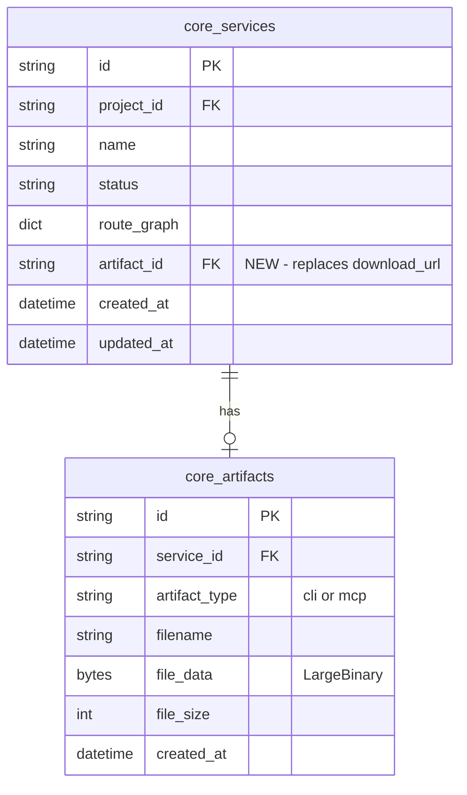

# feat: Backend Storage & Limits Cleanup

## Overview

Remove the 2-service-per-workspace limit and move generated ZIP packages from `/tmp/` to PostgreSQL via a new `core_artifacts` table. This makes the platform production-ready — no more ephemeral filesystem storage that breaks on restart or multi-instance deployment.

## Problem Statement

1. **Service limit is premature** — `MAX_SERVICES_PER_WORKSPACE = 2` in `parse.py:20` blocks users from parsing more than 2 repos. No billing system exists to justify tiers.

2. **ZIP storage is fragile** — Generated CLI/MCP packages land in `/tmp/genalpha-zip-*/`. The filesystem path is stored as `service.download_url`. This breaks on server restart, doesn't work in containers, and can't scale to multiple instances.

## Proposed Solution

### Change 1: Remove service limit

Delete `MAX_SERVICES_PER_WORKSPACE` and the enforcement block from `parse.py`. Remove the unused constant from `services.py`.

### Change 2: Store ZIPs in PostgreSQL

New `core_artifacts` table with a `LargeBinary` column. A new Temporal activity (`upload_artifact_activity`) reads the ZIP bytes and POSTs them to Core. A new download endpoint streams bytes from the DB.

## Technical Approach

### Architecture

```
GenerateWorkflow (current):
  generate_packages → package_zip → update_status(zip_path) → cleanup

GenerateWorkflow (new):
  generate_packages → package_zip → upload_artifact(bytes) → update_status → cleanup
```

The worker reads the ZIP bytes in a new `upload_artifact_activity`, POSTs them as `multipart/form-data` to `POST /services/{service_id}/artifacts` on Core, and receives back an `artifact_id`. The final `update_service_status` call then includes `artifact_id` in metadata so Core can set `service.artifact_id`.

### ERD



### Implementation Phases

#### Phase 1: Remove service limit

**Files:**
- `services/core/routes/parse.py` — delete lines 20-21 (`MAX_SERVICES_PER_WORKSPACE`, `ACTIVE_STATUSES`) and lines 59-74 (enforcement block)
- `services/core/routes/services.py` — delete lines 17-18 (`ACTIVE_STATUSES`, `MAX_SERVICES_PER_WORKSPACE`)

**Success criteria:**
- [ ] Users can create unlimited services per workspace
- [ ] No 429 errors on parse

#### Phase 2: Add `core_artifacts` model

**Files:**
- `services/core/models.py` — add `Artifact` SQLModel class

```python
# services/core/models.py
class Artifact(SQLModel, table=True):
    __tablename__ = "core_artifacts"

    id: str = Field(default_factory=generate_cuid, primary_key=True)
    service_id: str = Field(foreign_key="core_services.id", index=True)
    artifact_type: str  # "cli" or "mcp"
    filename: str
    file_data: bytes = Field(sa_column=Column(LargeBinary))
    file_size: int = 0
    created_at: datetime = Field(default_factory=utc_now)
```

- Add `artifact_id` to `Service` model:

```python
# On Service class
artifact_id: Optional[str] = Field(default=None, foreign_key="core_artifacts.id")
```

Note: `download_url` is kept as nullable for now — `create_all` cannot drop columns. It will be ignored in code but left in the DB schema until Alembic is introduced.

**Success criteria:**
- [ ] `core_artifacts` table created on startup
- [ ] `artifact_id` column added to `core_services`

#### Phase 3: Artifact upload endpoint + download endpoint

**Files:**
- `services/core/routes/artifacts.py` — NEW file

```python
# services/core/routes/artifacts.py
router = APIRouter(prefix="/services", tags=["artifacts"])

# POST /services/{service_id}/artifacts — receives multipart upload from worker
# GET /artifacts/{artifact_id}/download — streams binary to browser
```

Two endpoints:
1. `POST /services/{service_id}/artifacts` — accepts `multipart/form-data` with `file` (UploadFile), `artifact_type` (form field). Stores in `core_artifacts`, updates `service.artifact_id`. Deletes any previous artifact for this service (latest wins). Returns `{"artifact_id": "..."}`.
2. `GET /artifacts/{artifact_id}/download` — looks up artifact, returns `Response(content=artifact.file_data, media_type="application/zip", headers={"Content-Disposition": f'attachment; filename="{artifact.filename}"'})`.

- `services/core/main.py` — register the new router

```python
from services.core.routes.artifacts import router as artifacts_router
app.include_router(artifacts_router)
```

**Success criteria:**
- [ ] Worker can upload ZIP bytes via multipart POST
- [ ] Browser can download ZIP via GET
- [ ] Previous artifact is replaced on re-generate

#### Phase 4: Update GenerateWorkflow + worker activities

**Files:**
- `worker/activities/generate_activities.py` — add `upload_artifact_activity`

```python
@activity.defn
async def upload_artifact_activity(input: UploadArtifactInput) -> str:
    """Read ZIP from disk and POST to Core as multipart/form-data."""
    zip_bytes = Path(input.zip_path).read_bytes()
    async with httpx.AsyncClient(timeout=60.0) as client:
        resp = await client.post(
            f"{CORE_URL}/services/{input.service_id}/artifacts",
            files={"file": (input.filename, zip_bytes, "application/zip")},
            data={"artifact_type": input.artifact_type},
        )
    return resp.json()["artifact_id"]
```

- `worker/activities/schemas.py` — add `UploadArtifactInput` dataclass
- `worker/workflows/generate_workflow.py` — insert `upload_artifact_activity` between `package_zip` and `update_service_status`. Pass `artifact_id` in status metadata.
- `worker/worker.py` — register new activity

**Changes to existing status flow:**
- `services/core/routes/parse.py` lines 162-164 — remove the `zip_path` → `download_url` assignment. Instead, extract `artifact_id` from metadata and set `service.artifact_id`.

**Success criteria:**
- [ ] GenerateWorkflow uploads ZIP to Core after packaging
- [ ] `service.artifact_id` is set on completion
- [ ] Old `/tmp` files are still cleaned up

#### Phase 5: Frontend + proxy updates

**Files:**
- `web/src/app/api/artifacts/[[...path]]/route.ts` — NEW proxy route (copy pattern from `services/[[...path]]/route.ts`)
- `web/src/lib/proxy.ts` — ensure binary responses are passed through without text corruption. The `proxyToCore` helper currently calls `request.text()` which corrupts binary. For the download endpoint, pipe the response body as-is.
- `web/src/data/types.ts` — add `artifact_id: string | null` to `Service` interface
- `web/src/app/(app)/services/[id]/page.tsx` — change download href from `/api/services/${service.id}/download` to `/api/artifacts/${service.artifact_id}/download`
- `web/src/components/generate-panel.tsx` — update download URL construction to use `artifact_id`

**Success criteria:**
- [ ] Download button works through the new artifact endpoint
- [ ] Binary ZIP downloads without corruption through Next.js proxy
- [ ] Old download endpoint can be removed (or returns 410)

## Acceptance Criteria

### Functional
- [ ] No service creation limit exists
- [ ] Generated ZIPs are stored in PostgreSQL `core_artifacts` table
- [ ] Download works via `GET /artifacts/{id}/download`
- [ ] Re-generating a service replaces the previous artifact (latest wins)
- [ ] Deleting a service deletes its artifact (cascade or explicit)
- [ ] Frontend download button works end-to-end

### Non-Functional
- [ ] ZIP uploads handle files up to 50MB (timeout = 60s)
- [ ] `core_artifacts` FK has `ON DELETE CASCADE` behavior (explicit delete before service delete, since SQLModel doesn't support DDL cascade via `create_all`)

## Dependencies & Risks

| Risk | Mitigation |
|------|------------|
| `create_all` can't drop `download_url` column | Leave column as nullable, ignore in code. Drop later with Alembic. |
| Binary corruption through Next.js proxy | Fix `proxy.ts` to handle non-JSON responses, or use a dedicated streaming proxy for artifact downloads. |
| Large ZIPs blocking async event loop | Use `run_in_executor` for DB reads of large binaries, or stream with chunks. |
| Temporal can't serialize large bytes | Don't pass bytes through Temporal — upload via HTTP in a dedicated activity. |
| Existing `complete` services have `/tmp` paths | They'll need re-generation. Set `artifact_id = null` — frontend already checks status. |

## References

- Brainstorm: `docs/design/brainstorms/2026-04-11-backend-storage-and-limits-brainstorm.md`
- Current models: `services/core/models.py`
- Limit enforcement: `services/core/routes/parse.py:20,59-74`
- Download endpoint: `services/core/routes/services.py:116-145`
- Generate workflow: `worker/workflows/generate_workflow.py`
- ZIP packaging: `worker/activities/generate_activities.py:58-78`
- Frontend download: `web/src/app/(app)/services/[id]/page.tsx:98-105`
- Proxy helper: `web/src/lib/proxy.ts`
