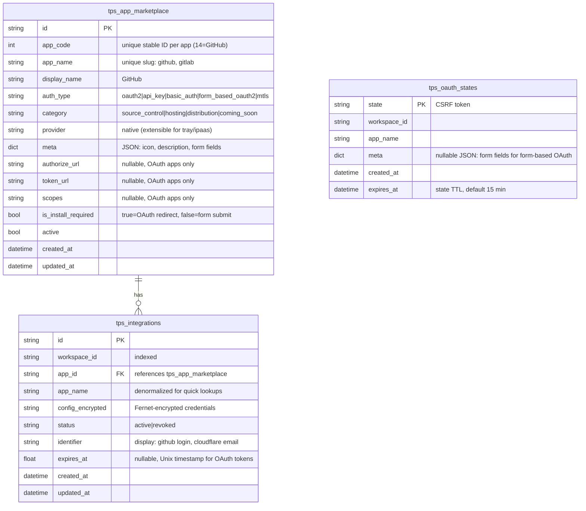

# feat: TPS Architecture Rewrite

## Overview

Rewrite the Python TPS from a single-app GitHub OAuth service into an extensible app integration platform. Build the full architecture (5 auth types, Alembic migrations, separate DB, dynamic form fields, token refresh with expiry tracking) but ship with only GitHub. Adding new apps = one handler file + one Alembic migration.

## Problem Statement

The current TPS has:
- 1 app (GitHub), hardcoded everywhere
- 1 auth type (OAuth2 only)
- No migrations (seed data on startup)
- Shared database with Core
- Hardcoded redirect URI and callback page
- No token expiry tracking (GitHub tokens don't expire)
- No race condition protection on refresh
- No form field definitions for frontend

The App Store feature requires: multiple apps, multiple auth types, dynamic connect modals, hosting integrations, and a clear "add a new app" developer experience.

## Technical Approach

### ERD



### App Categories

Categories drive platform behavior, not just display:

| Category | Capability | How Platform Uses It |
|----------|-----------|---------------------|
| `source_control` | Clone repos | Parse flow: "select source" dropdown shows only these |
| `hosting` | Deploy packages | Host tab: shows connected hosting apps as buttons |
| `distribution` | Publish to registries | Generate flow: publish to PyPI/npm |
| `coming_soon` | Display only | App Store: grayed out, no connect button |

Stored as a `VARCHAR` (not Postgres ENUM) so new categories don't need `ALTER TYPE` migrations.

### Auth Type Flows

**OAuth2** (`is_install_required=true`):
```
POST /integrations/{app_name}/install → { authorize_url, state }
→ Browser redirect → Provider → Callback
POST /integrations/{app_name}/exchange → { integration_id, status }
```

**API Key / Basic Auth / mTLS** (`is_install_required=false`):
```
POST /integrations/{app_name}/connect → { credentials from form } → { integration_id, status }
```

**Form-based OAuth2** (`is_install_required=true`, user provides tenant fields first):
```
POST /integrations/{app_name}/install → { tenant_url, ... } → { authorize_url, state }
→ Form fields persisted in OAuthState.meta JSON
→ Browser redirect → Provider → Callback
POST /integrations/{app_name}/exchange → { integration_id, status }
```

### Meta JSON Schema

The `meta` column on `tps_app_marketplace` defines how the frontend renders each app:

```json
{
  "icon": "/images/github.svg",
  "description": "Connect your GitHub repositories",
  "form_fields": [
    {
      "reference_key": "api_token",
      "type": "password",
      "display_name": "API Token",
      "required": true,
      "placeholder": "ghp_xxxxxxxxxxxx"
    },
    {
      "reference_key": "org_url",
      "type": "url",
      "display_name": "Organization URL",
      "required": false,
      "placeholder": "https://github.com/myorg"
    }
  ]
}
```

Frontend reads `auth_type` + `meta.form_fields` to decide: OAuth → redirect, API Key/Basic Auth → render form modal dynamically.

### Credential Storage

| What | Where | Why |
|------|-------|-----|
| Platform OAuth creds (`client_id`/`secret`) | Env vars: `TPS_GITHUB_CLIENT_ID` | Same for all users, deploy-time |
| User OAuth tokens | `tps_integrations.config_encrypted` | Per-user, runtime |
| User API keys / passwords | `tps_integrations.config_encrypted` | Per-user, connect-time |
| Tenant OAuth app creds (Form-based) | `tps_integrations.config_encrypted` | Per-tenant, connect-time |

Encryption: `MultiFernet` (supports key rotation via comma-separated `TPS_FERNET_KEYS` env var).

### Token Refresh

`get_or_refresh()` enhanced with:
1. Check `integration.expires_at` (plaintext column, no decryption needed)
2. If `expires_at - now < 120s`: acquire `SELECT FOR UPDATE` lock on the row
3. Double-check after lock (another process may have refreshed)
4. Call `handler.refresh_token(config)` → update `config_encrypted` + `expires_at`
5. Return fresh config

### Handler Protocol

Split into auth-type-specific protocols inheriting from a base:

```python
class AppHandler(Protocol):
    """Base — all handlers implement these."""
    def get_app_name(self) -> str: ...
    def get_user_info(self, config: dict) -> dict: ...  # optional, returns {}

class OAuthHandler(AppHandler, Protocol):
    """OAuth2 and Form-based OAuth2 apps."""
    def get_authorize_url(self, redirect_uri: str, form_data: dict | None) -> tuple[str, str]: ...
    def exchange_code(self, code: str, redirect_uri: str, form_data: dict | None) -> dict: ...
    def refresh_token(self, config: dict) -> dict: ...
    def is_token_expired(self, config: dict) -> bool: ...

class CredentialHandler(AppHandler, Protocol):
    """API Key, Basic Auth, mTLS apps."""
    def validate_credentials(self, config: dict) -> bool: ...
```

Route dispatch checks `app.auth_type`:
- `oauth2`, `form_based_oauth2` → use `OAuthHandler` methods
- `api_key`, `basic_auth`, `mtls` → use `CredentialHandler` methods

### Breaking Changes to Core

**`Workspace.integration_id`** — currently holds a single integration ID. With multi-app support, this becomes meaningless. Plan:
1. Keep column as-is (nullable, no longer written to)
2. Core's integration routes query TPS by `(workspace_id, app_name)` instead
3. Drop column in a future migration when safe

**Callback page** — currently hardcodes `"github"`. Fix:
1. `OAuthState` already stores `app_name`
2. Add `GET /integrations/resolve-state?state=X` endpoint that returns `{ app_name }`
3. Callback page calls this first, then POSTs to `/integrations/{app_name}/exchange`

## Implementation Phases

### Phase 1: Infrastructure (Separate DB + Alembic)

**Tasks:**
- [ ] Add `tps` database to `docker-compose.yml`
- [ ] Update `services/tps/config.py` with new `TPS_DATABASE_URL` pointing to `tps` DB
- [ ] Update `services/tps/deps.py` to use new DB URL
- [ ] Initialize Alembic: `alembic init -t async services/tps/migrations`
- [ ] Configure `alembic.ini` and `env.py` for async SQLModel
- [ ] Add `sqlmodel` import to `script.py.mako`
- [ ] Remove `SQLModel.metadata.create_all` and `seed_marketplace()` from `main.py`
- [ ] Add `alembic upgrade head` as a Docker Compose init step for dev

**Files:**
```
docker-compose.yml
services/tps/config.py
services/tps/deps.py
services/tps/main.py
services/tps/alembic.ini
services/tps/migrations/env.py
services/tps/migrations/script.py.mako
```

**Success criteria:**
- [ ] `alembic revision --autogenerate` detects TPS models
- [ ] `alembic upgrade head` creates tables in the `tps` database
- [ ] TPS service starts and connects to new DB

### Phase 2: Enhanced Models + Initial Migration

**Tasks:**
- [ ] Rewrite `services/tps/models.py` with enhanced schema (see ERD above)
- [ ] Add enums: `AuthType`, `AppCategory`, `AppProvider` as Python `StrEnum`
- [ ] Upgrade `MultiFernet` in `crypto.py` (key rotation support)
- [ ] Create Alembic migration `001_initial_schema.py`: all 3 tables
- [ ] Create Alembic migration `002_seed_github.py`: INSERT GitHub app with full `meta` JSON

**Models changes:**
```python
# services/tps/models.py

class AuthType(str, Enum):
    OAUTH2 = "oauth2"
    API_KEY = "api_key"
    BASIC_AUTH = "basic_auth"
    FORM_BASED_OAUTH2 = "form_based_oauth2"
    MTLS = "mtls"

class AppCategory(str, Enum):
    SOURCE_CONTROL = "source_control"
    HOSTING = "hosting"
    DISTRIBUTION = "distribution"
    COMING_SOON = "coming_soon"

class AppProvider(str, Enum):
    NATIVE = "native"

class AppMarketplace(SQLModel, table=True):
    __tablename__ = "tps_app_marketplace"
    id: str = Field(default_factory=generate_cuid, primary_key=True)
    app_code: int = Field(unique=True)  # stable ID: 14=GitHub, 95=GitLab
    app_name: str = Field(unique=True, index=True)
    display_name: str
    auth_type: str  # AuthType value
    category: str  # AppCategory value
    provider: str = Field(default="native")
    meta: dict = Field(default_factory=dict, sa_column=Column(JSON))
    authorize_url: Optional[str] = None
    token_url: Optional[str] = None
    scopes: Optional[str] = None
    is_install_required: bool = True
    active: bool = True
    created_at: datetime = Field(default_factory=utc_now)
    updated_at: datetime = Field(default_factory=utc_now)

class Integration(SQLModel, table=True):
    __tablename__ = "tps_integrations"
    id: str = Field(default_factory=generate_cuid, primary_key=True)
    workspace_id: str = Field(index=True)
    app_id: str = Field(foreign_key="tps_app_marketplace.id", index=True)
    app_name: str = Field(index=True)  # denormalized
    config_encrypted: str
    status: str = Field(default="active")
    identifier: Optional[str] = None  # display: github login, email, etc.
    expires_at: Optional[float] = None  # Unix timestamp, plaintext for fast checks
    created_at: datetime = Field(default_factory=utc_now)
    updated_at: datetime = Field(default_factory=utc_now)

class OAuthState(SQLModel, table=True):
    __tablename__ = "tps_oauth_states"
    state: str = Field(primary_key=True)
    workspace_id: str
    app_name: str
    meta: Optional[dict] = Field(default=None, sa_column=Column(JSON))
    created_at: datetime = Field(default_factory=utc_now)
    expires_at: datetime  # 15 min TTL
```

**Success criteria:**
- [ ] `alembic upgrade head` creates all 3 tables with correct columns
- [ ] GitHub app seeded in marketplace with full meta JSON
- [ ] `MultiFernet` key rotation works

### Phase 3: Handler Architecture

**Tasks:**
- [ ] Extend `handlers/base.py` with `OAuthHandler` and `CredentialHandler` protocols
- [ ] Add `revoke_token()` to `OAuthHandler` (default no-op)
- [ ] Update `handlers/github.py` to implement `OAuthHandler`
- [ ] Update handler registry to return typed handlers
- [ ] Per-app config via env vars: `TPS_GITHUB_CLIENT_ID`, etc.
- [ ] Update `services/tps/config.py` to support per-app env vars

**Files:**
```
services/tps/handlers/base.py
services/tps/handlers/github.py
services/tps/handlers/__init__.py
services/tps/config.py
```

**Success criteria:**
- [ ] GitHub handler satisfies `OAuthHandler` protocol
- [ ] Handler registry resolves by `app_name`
- [ ] Per-app config loaded from env vars

### Phase 4: Routes — Multi-Auth Endpoints

**Tasks:**
- [ ] Add `POST /integrations/{app_name}/connect` — for API Key/Basic Auth/mTLS
- [ ] Update `POST /integrations/{app_name}/install` — generic OAuth, reads app from marketplace DB
- [ ] Update `POST /integrations/{app_name}/exchange` — validate state, branch by auth type
- [ ] Add `GET /integrations/resolve-state` — returns `app_name` for a given OAuth state (for callback page)
- [ ] Update `GET /apps` — return full marketplace with `meta`, `category`, `auth_type`
- [ ] Update `integration_service.py` — `get_or_refresh()` with `SELECT FOR UPDATE`, `expires_at` column
- [ ] Add OAuthState cleanup: delete states older than 15 min on each `/install` call
- [ ] Update `DELETE /integrations/{id}` — call `handler.revoke_token()` before soft delete

**Files:**
```
services/tps/routes/integrations.py
services/tps/routes/apps.py
services/tps/integration_service.py
```

**Success criteria:**
- [ ] OAuth2 install/exchange flow works for GitHub (regression test)
- [ ] `/connect` endpoint accepts and stores API Key credentials
- [ ] `resolve-state` returns correct `app_name`
- [ ] Token refresh uses `SELECT FOR UPDATE` to prevent race conditions
- [ ] Stale OAuth states cleaned up

### Phase 5: Core + Frontend Updates

**Tasks:**
- [ ] Update `services/core/routes/integrations.py` — stop writing `workspace.integration_id`, query by `(workspace_id, app_name)` instead
- [ ] Update `web/src/data/types.ts` — add `category`, `meta`, `auth_type` to `AppMarketplace` interface
- [ ] Update callback page — call `resolve-state` to get `app_name` before exchange
- [ ] Core proxy: add `/integrations/{app_name}/connect` proxy route
- [ ] Core proxy: add `/integrations/resolve-state` proxy route

**Files:**
```
services/core/routes/integrations.py
services/core/models.py (Workspace — deprecate integration_id)
web/src/data/types.ts
web/src/app/(app)/settings/integrations/callback/page.tsx
```

**Success criteria:**
- [ ] Full OAuth2 flow works end-to-end (GitHub)
- [ ] Callback page dynamically resolves app_name
- [ ] Core no longer writes to `workspace.integration_id`

### Phase 6: Tests

**Tasks:**
- [ ] Test: OAuth2 install → exchange → get_or_refresh flow
- [ ] Test: API Key connect flow (mock Cloudflare-like app)
- [ ] Test: Basic Auth connect flow
- [ ] Test: Token refresh with expired token
- [ ] Test: Token refresh race condition (concurrent requests)
- [ ] Test: Disconnect with config wipe
- [ ] Test: App marketplace listing with categories and form fields
- [ ] Test: OAuthState expiry cleanup
- [ ] Test: MultiFernet key rotation

**Files:**
```
tests/core/test_tps_integration.py (or tests/tps/)
```

**Success criteria:**
- [ ] All existing tests still pass
- [ ] New tests cover all 5 auth types
- [ ] Race condition test validates `SELECT FOR UPDATE` behavior

## Acceptance Criteria

### Functional
- [ ] `GET /apps` returns apps with `meta` JSON, `category`, `auth_type`
- [ ] OAuth2 flow works for GitHub (regression)
- [ ] `POST /integrations/{app_name}/connect` works for credential-based apps
- [ ] Token refresh proactively refreshes before expiry
- [ ] Disconnect soft-deletes and wipes encrypted config
- [ ] Adding a new app = 1 handler file + 1 Alembic migration (no other changes)

### Non-Functional
- [ ] All credentials encrypted with MultiFernet
- [ ] Token refresh protected by `SELECT FOR UPDATE` (no race condition)
- [ ] OAuthState expires after 15 minutes
- [ ] Separate `tps` database (not shared with Core)

## Dependencies & Risks

| Risk | Mitigation |
|------|------------|
| Existing GitHub integrations in old schema | Alembic data migration: backfill `app_id`, rename `github_username` → `identifier` |
| `Workspace.integration_id` removal breaks Core | Deprecate (stop writing), don't drop column yet |
| Callback page hardcodes GitHub | Fix in Phase 5 with `resolve-state` endpoint |
| `create_all` vs Alembic conflict on startup | Remove `create_all` from `main.py` lifespan entirely |
| Form-based OAuth2 loses form data on redirect | Store in `OAuthState.meta` JSON column |

## References

- Brainstorm: `docs/design/brainstorms/2026-04-11-tps-architecture-rewrite-brainstorm.md`
- Java TPS reference: `/Users/nandisha/Desktop/Atomicwork/third-party-app-integration/`
- Current Python TPS: `services/tps/`
- Current TPS models: `services/tps/models.py`
- Current handlers: `services/tps/handlers/`
- Current routes: `services/tps/routes/`
- Core integration routes: `services/core/routes/integrations.py`
- Alembic async docs: https://alembic.sqlalchemy.org/en/latest/cookbook.html
